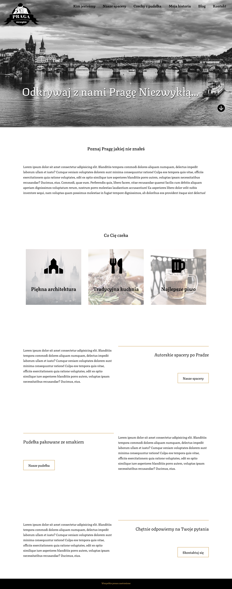
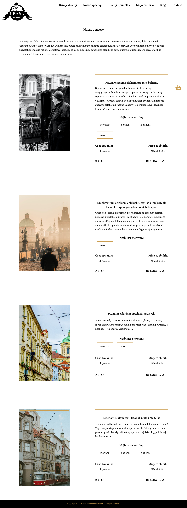
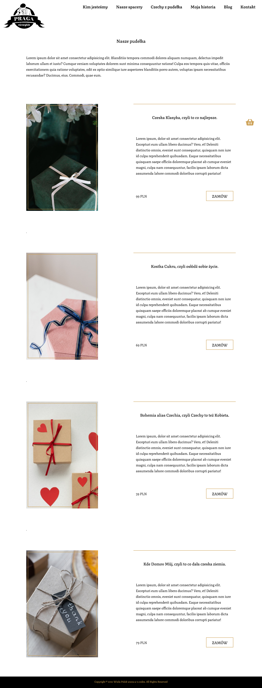
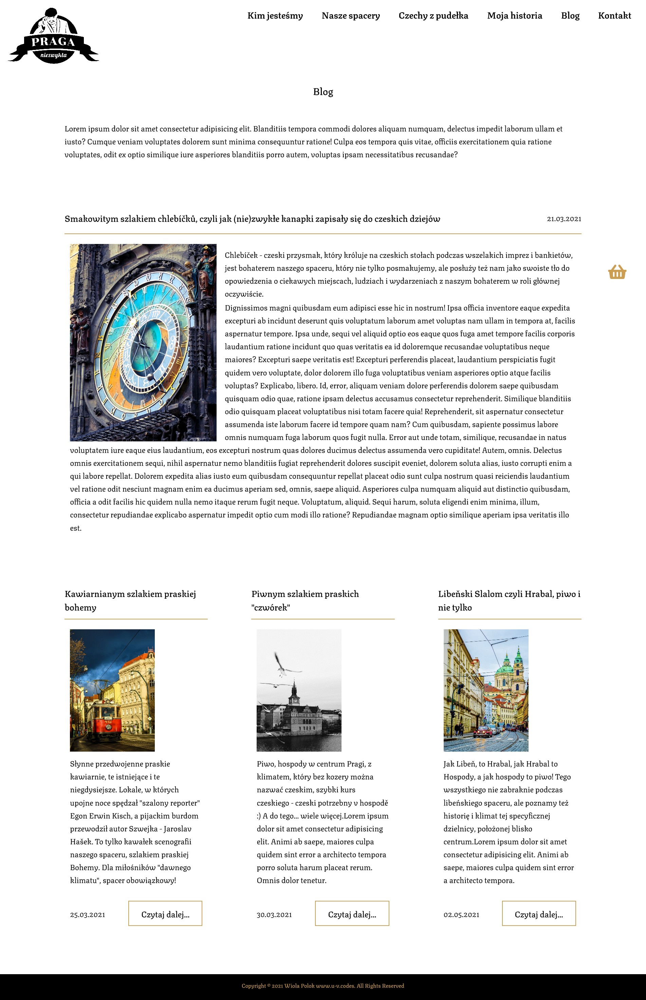

# Praga Niezwykła

> Praga Niezwykła is a home website and blog created for Prague tour guide.

It is also a online store where visitor can order misteourous boxes with czech products and make a reservation for different tours in Prague.

Project will be published on Wordpress platform to make administrate changes possible for client by himself.

> Live demo [_here_](https://wiolinek.github.io/Praga-niezwykla/).

## Table of Contents

- [Technologies Used](#technologies-used)
- [Screenshots](#screenshots)
- [Project Status](#project-status)
- [License](#license)
- [Contact](#contact)

## Technologies Used

- BEM

## Screenshots

## Project Status

Project is: _in progress_

## Room for Improvement

- animations
- media queries
- placing project to Wordpress platform
- add Woocommerce plugin

## License

This website was built by Wiola Polok www.u-v.codes.
Copyright @ 2021 Wiola Polok www.u-v.codes. All Rights Reserved.
You are allowed to use it for both personal and commercial use, but not to claim it as your own design.

## Contact

Created by [@Wiolinek](https://github.com/Wiolinek) - feel free to contact me!
